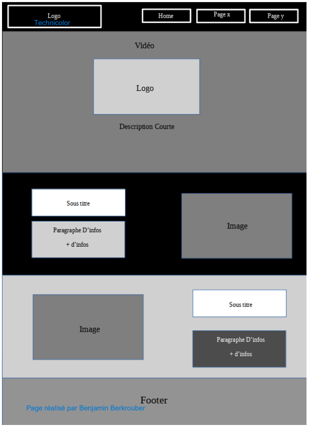
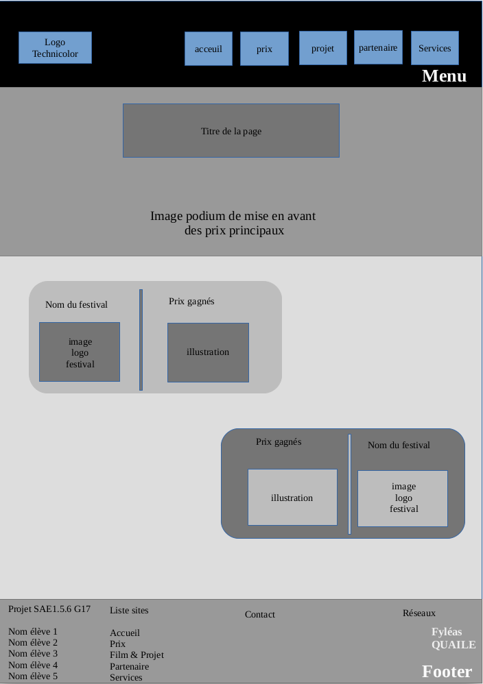
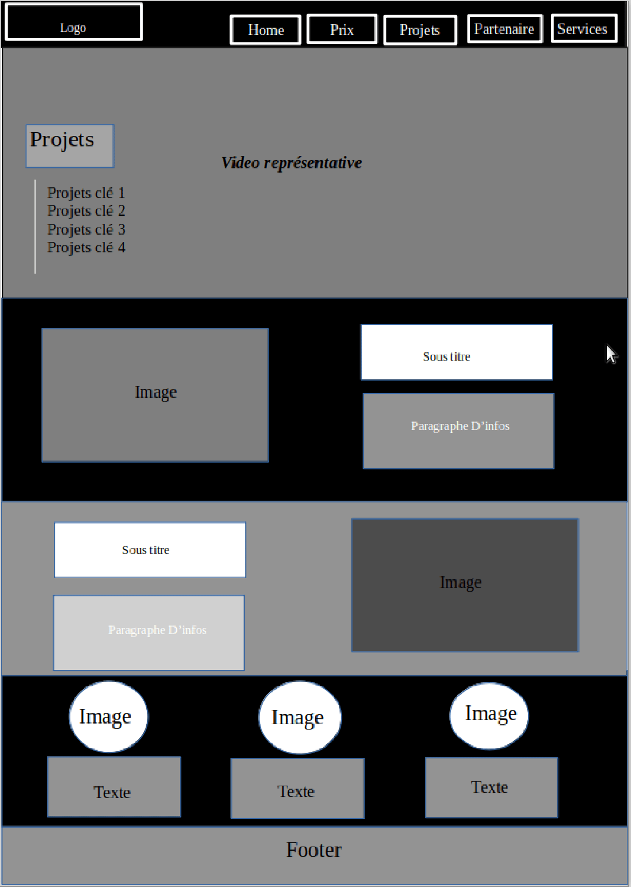
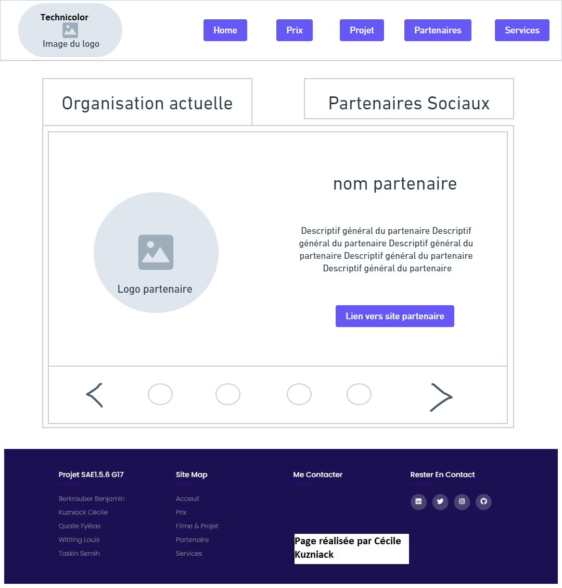
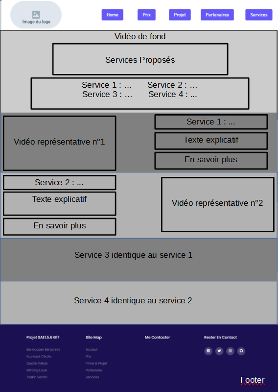

# Site de présentation de TechniColor 

Bienvenue sur le projet de SAE.05.06 du groupe G17 dans le projet C2

## Quelle est notre projet :

Nous créons un site de présentation de l'entreprise TechniColor en suivant le modèle et les consigne qui nous 
on était données dans le cadre de notre SAE.05.06

## Participant : 
- Etudiant 1 (référent du groupe) :  [BERKROUBER Benjmain](mailto:login@edu.univ-fcomte.fr?subject=SAE_1_05_06) 
- Etudiant 2 : [Kuzniack Cécile ](mailto:cecile.kuznack@edu.univ-fcomte.fr?subject=SAE_1_05_06) 
- Etudiant 3 : [Quaile Fyléas ](mailto:fyleas.quaile@edu.univ-fcomte.fr?subject=SAE_1_05_06) 
- Etudiant 4 : [Wittling Louis](mailto:louis.wittling@edu.univ-fcomte.fr?subject=SAE_1_05_06) 
- Etudiant 5 : [Taskin Semih ](mailto:semih.taskin@edu.univ-fcomte.fr?subject=SAE_1_05_06)

## Zoning :

**Terminer**

Les zonings sont disponile dans si dessous : 
- ✅

**En cours**

- ✅
- ✅
- ✅
- ✅

## Ecran prototype du site : 
- ✅

## Avancememnt : 

__HTML__
- index.html (BERKROUBER Benjamin)
  * header 
    * ✅ Logo
    * ✅ Video 
    * ✅ Menu de navigation 
    * ❌ Responsive 
  * main 
    * ✅ Profil PDG
    * ❌ Slider Historique
  * footer 
    * ✅ Personne de la SAE
    * ✅ Site map
    * ❌ Catégorie 4
    * ✅ Liens Entreprise

- prix.html (QUAILE Fyléas)
  * header 
    * ✅ Logo
    * ✅ Video 
    * ✅ Menu de navigation 
    * ❌ Responsive 
  * main 
    * 
  * footer 
    * ✅ Personne de la SAE
    * ✅ Site map
    * ❌ Catégorie 4
    * ✅ Liens Entreprise

- projet.html (TASKIN Semih)
  * header 
    * ✅ Logo
    * ✅ Video 
    * ✅ Menu de navigation 
    * ❌ Responsive 
  * main 
    * 
  * footer 
    * ✅ Personne de la SAE
    * ✅ Site map
    * ❌ Catégorie 4
    * ✅ Liens Entreprise

- partenaire.html (KUZZNIACK Cécile)
  * header 
    * ✅ Logo
    * ✅ Video 
    * ✅ Menu de navigation 
    * ❌ Responsive 
  * main 
    * 
  * footer 
    * ✅ Personne de la SAE
    * ✅ Site map
    * ❌ Catégorie 4
    * ✅ Liens Entreprise
  
  - services.html (WITTLING Louis)
  * header 
    * ✅ Logo
    * ✅ Video 
    * ✅ Menu de navigation 
    * ❌ Responsive 
  * main 
    * 
  * footer 
    * ✅ Personne de la SAE
    * ✅ Site map
    * ❌ Catégorie 4
    * ✅ Liens Entreprise

__CSS__ 

- style_header.css (BERKROUBER Benjamin)

- style_footer.css (BERKROUBER Benjamin)

- style_index.css (BERKROUBER Benjamin)

- style_prix.css (QUAILE Fyléas)

- style_projet.css (TASKIN Semih)

- style_partenaires.css (KUZZNIACK Cécile)

- style_services.css (WITTLING Louis)

__JS__
- app.js (BERKROUBER Benjamin)

## Liens des consignes : 

[Consigne pdf](https://github.com/SAEC2G17/technicolor/blob/main/Cours_Lato.pdf)

## Langages utilisés ?
- HTML5
- CSS3
- Java,Script
